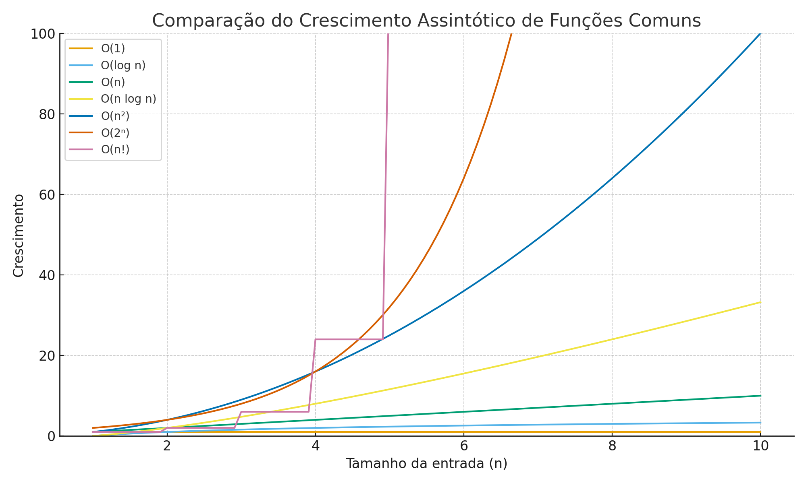

# Aula 02 - 28/08

---

 # Crescimento Assintótico de funções na Análise de Complexidade de Algoritmos

O crescimento assintótico descreve como o tempo de execução (ou uso de recursos) de um algoritmo se comporta **à medida que o tamanho da entrada cresce indefinidamente (n → ∞)**. Ele abstrai fatores constantes e termos menos relevantes, permitindo a comparação objetiva entre algoritmos.

> Crescimento assintótico olha para o que importa **quando o tamanho da entrada fica muito grande**.  
> É como focar na estrada cheia de carros em um feriado prolongado: detalhes pequenos não importam, só o comportamento geral importa.

> #### O crescimento assintótico analisa como o algoritmo escala quando \( n \to \infty \).

---

# Crescimento Assintótico: Exemplo de Salário

Imagine quatro propostas de emprego, onde o salário 💰 depende das horas 📈 trabalhadas $h$:

1. 💰 **Proposta A:** 📈 $salario(h)=500+h$  
2. 💰 **Proposta B:** 📈 $salario(h)=100+h^2$   
3. 💰 **Proposta C:** 📈 $salario(h)=50+h^3$ 
4. 💰 **Proposta D:** 📈 $salario(h)=20+2^h$ 

# Crescimento Assintótico: Salário

| Horas (h) | Proposta A: 💰500 + 📈h | Proposta B: 💰100 + 📈h² | Proposta C: 💰50 + 📈h³ | Proposta D: 💰20 + 📈2^h |
|------------|-----------------------|------------------------|-----------------------|-------------------------|
| 1          | 501                   | 101                    | 51                    | 22                      |
| 2          | 502                   | 104                    | 58                    | 24                      |
| 3          | 503                   | 109                    | 77                    | 28                      |
| 5          | 505                   | 125                    | 175                   | 52                      |
| 8          | 508                   | 164                    | 562                   | 276                     |
| 10         | 510                   | 200                    | 1050                  | 1024                    |
| 12         | 512                   | 244                    | 1750                  | 4096                    |
| 15         | 515                   | 325                    | 3380                  | 32768                   |

> Observações:  
> - Crescimento assintótico = ignorar os bônus 💰 e analisar como o salário cresce 📈 para muitas horas (\( n \to \infty \)).
> - Para poucas horas, **Proposta A parece a melhor** por causa do grande bônus 💰.  
> - Quando h cresce, **constantes deixam de importar** e funções que crescem mais rápido dominam 📈: D > C > B > A.  
> - Isso ilustra o conceito de **crescimento assintótico**.

---

# Definição da Notação O (Big-O)

A notação **Big-O** descreve um **limite superior assintótico** para o crescimento de uma função. É usada para representar o pior caso de tempo de execução ou consumo de recursos de um algoritmo quando o tamanho da entrada cresce indefinidamente.

## Definição Formal

Dizemos que uma função $f(n)$ é **$O(g(n))$** se existem **constantes positivas** $c > 0$ e $n_0 \geq 1$ tais que:

$$
f(n) \leq c \cdot g(n), \quad \forall n \geq n_0
$$

### Interpretação

- $f(n)$ é a função real de custo/tempo do algoritmo.  
- $g(n)$ é a função de referência que descreve o crescimento esperado.  
- $c$ é um fator constante que multiplica $g(n)$ para garantir que ele sempre seja um limite superior para $f(n)$ a partir de $n_0$.  
- $n_0$ é o ponto a partir do qual a desigualdade é sempre válida.

### Exemplo

Se $f(n) = 5n^2 + 3n + 10$, podemos provar que:

$$
f(n) \leq 6n^2, \quad \forall n \geq 1
$$

Portanto, $f(n)$ é **$O(n^2)$**.

---

## Intuição

- Big-O **ignora constantes e termos menos significativos**, pois eles se tornam irrelevantes para $n \to \infty$.  
- Representa um **limite superior**, ou seja, a complexidade não crescerá mais rápido do que $g(n)$ dentro de um fator constante.

---

## Ômega ($\Omega$)
Descreve um **limite inferior** para o crescimento (melhor caso).

Definição formal:  

$f(n) = \Omega(g(n))$ se $\exists \ c>0,\ n_0 \ge 1$ tal que  
$$
f(n) \geq c \cdot g(n), \quad \forall n \geq n_0
$$

---

## Teta ($\Theta$)
Descreve um **limite exato** (melhor e pior caso assintoticamente iguais).

Definição formal:  
$f(n) = \Theta(g(n))$ se $\exists \ c_1, c_2>0,\ n_0 \ge 1$ tal que  
$$
c_1 \cdot g(n) \le f(n) \le c_2 \cdot g(n),\ \forall n \ge n_0
$$

---

## Principais Notações Assintóticas

1. **O (Big-O)**  
   - Limite superior do crescimento.  
   - Responde: *"Qual é o pior caso?"*  
   - Exemplo: `5n² + 3n + 10` → **O(n²)**

2. **Ω (Ômega)**  
   - Limite inferior.  
   - Responde: *"Qual é o melhor caso?"*  
   - Exemplo: Algoritmo executa pelo menos `2n` operações → **Ω(n)**

3. **Θ (Teta)**  
   - Limite exato de crescimento.  
   - Responde: *"Como ele cresce em geral?"*  
   - Exemplo: Limitado por cima e por baixo por `c·n²` → **Θ(n²)**

4. **o (o pequeno)**  
   - Limite superior **não apertado** (cresce mais devagar que outra função).  
   - Exemplo: `n` é `o(n²)`

5. **ω (ômega pequeno)**  
   - Limite inferior **não apertado** (cresce mais rápido que outra função).  
   - Exemplo: `n²` é `ω(n)`

---

## Aplicação na Análise de Algoritmos

- Prever desempenho para entradas muito grandes.  
- Ignorar detalhes específicos de hardware e implementação.  
- Comparar algoritmos de diferentes naturezas (ex.: `O(n log n)` vs `O(n²)`).

---

## Exemplos de Crescimento Comum

- **O(1)**: constante  
- **O(log n)**: logarítmico (ex.: busca binária)  
- **O(n)**: linear  
- **O(n log n)**: quase linear (ex.: mergesort, heapsort)  
- **O(n²)**: quadrático (ex.: bubble sort, selection sort)  
- **O(2ⁿ)**: exponencial  
- **O(n!)**: fatorial (ex.: força bruta para o problema do caixeiro viajante)

---

## Algoritmos de busca em Python

### Pesquisa Sequencial (linear)

~~~py
def busca_sequencial(lista, alvo):
    """
    Retorna o índice do alvo na lista se encontrado, caso contrário -1.
    """
    for i, valor in enumerate(lista):
        if valor == alvo:
            return i  # elemento encontrado
    return -1  # elemento não encontrado

# Exemplo de uso:
numeros = [10, 20, 30, 40, 50]
indice = busca_sequencial(numeros, 30)
print(indice)  # Saída: 2
~~~

### Pesquisa Binária

~~~py
def busca_binaria(lista, alvo):
    """
    Retorna o índice do alvo na lista se encontrado, caso contrário -1.
    A lista precisa estar ordenada.
    """
    esquerda = 0
    direita = len(lista) - 1

    while esquerda <= direita:
        meio = (esquerda + direita) // 2
        if lista[meio] == alvo:
            return meio  # elemento encontrado
        elif lista[meio] < alvo:
            esquerda = meio + 1  # busca na metade direita
        else:
            direita = meio - 1  # busca na metade esquerda

    return -1  # elemento não encontrado

# Exemplo de uso:
numeros = [1, 3, 5, 7, 9, 11, 13]
indice = busca_binaria(numeros, 7)
print(indice)  # Saída: 3

~~~

### Ordenação Bolha

~~~py
def bubble_sort(lista):
    """
    Ordena a lista em ordem crescente usando o algoritmo bolha.
    """
    n = len(lista)
    for i in range(n):
        # Cada iteração "bolha" coloca o maior elemento no final
        for j in range(0, n - i - 1):
            if lista[j] > lista[j + 1]:
                # Troca os elementos de posição
                lista[j], lista[j + 1] = lista[j + 1], lista[j]

# Exemplo de uso:
numeros = [64, 34, 25, 12, 22, 11, 90]
bubble_sort(numeros)
print(numeros)  # Saída: [11, 12, 22, 25, 34, 64, 90]
~~~

### Ordenação por inserção 

~~~py
def insertion_sort(lista):
    """
    Ordena a lista em ordem crescente usando o algoritmo de inserção.
    """
    for i in range(1, len(lista)):
        chave = lista[i]
        j = i - 1
        # Move os elementos maiores que a chave uma posição à frente
        while j >= 0 and lista[j] > chave:
            lista[j + 1] = lista[j]
            j -= 1
        lista[j + 1] = chave

# Exemplo de uso:
numeros = [12, 11, 13, 5, 6]
insertion_sort(numeros)
print(numeros)  # Saída: [5, 6, 11, 12, 13]
~~~

### Ordenação por Seleção

~~~py
def selection_sort(lista):
    """
    Ordena a lista em ordem crescente usando o algoritmo de seleção.
    """
    n = len(lista)
    for i in range(n):
        # Encontra o índice do menor elemento na parte não ordenada
        min_idx = i
        for j in range(i + 1, n):
            if lista[j] < lista[min_idx]:
                min_idx = j
        # Troca o elemento encontrado com o primeiro da parte não ordenada
        lista[i], lista[min_idx] = lista[min_idx], lista[i]

# Exemplo de uso:
numeros = [64, 25, 12, 22, 11]
selection_sort(numeros)
print(numeros)  # Saída: [11, 12, 22, 25, 64]
~~~

### Ordenação MergeSort

~~~py
def merge(esquerda, direita):
    """
    Recebe duas listas ordenadas e retorna uma lista única ordenada.
    """
    resultado = []
    i = j = 0

    while i < len(esquerda) and j < len(direita):
        if esquerda[i] < direita[j]:
            resultado.append(esquerda[i])
            i += 1
        else:
            resultado.append(direita[j])
            j += 1

    # Adiciona os elementos restantes
    resultado.extend(esquerda[i:])
    resultado.extend(direita[j:])
    return resultado

def merge_sort(lista):
    """
    Ordena a lista em ordem crescente usando Merge Sort.
    Retorna uma nova lista ordenada.
    """
    if len(lista) <= 1:
        return lista

    meio = len(lista) // 2
    esquerda = merge_sort(lista[:meio])
    direita = merge_sort(lista[meio:])
    
    return merge(esquerda, direita)

# Exemplo de uso:
numeros = [38, 27, 43, 3, 9, 82, 10]
numeros_ordenados = merge_sort(numeros)
print(numeros_ordenados)  # Saída: [3, 9, 10, 27, 38, 43, 82]
~~~

### Ordenação QuickSort

~~~py
def partition(lista, inicio, fim):
    """
    Particiona a lista em torno do pivô e retorna o índice final do pivô.
    """
    pivo = lista[fim]  # escolhe o último elemento como pivô
    i = inicio - 1

    for j in range(inicio, fim):
        if lista[j] <= pivo:
            i += 1
            lista[i], lista[j] = lista[j], lista[i]
    
    lista[i + 1], lista[fim] = lista[fim], lista[i + 1]
    return i + 1

def quick_sort(lista, inicio=0, fim=None):
    """
    Ordena a lista em ordem crescente usando Quick Sort.
    """
    if fim is None:
        fim = len(lista) - 1

    if inicio < fim:
        p = partition(lista, inicio, fim)  # divide a lista
        quick_sort(lista, inicio, p - 1)   # ordena a parte esquerda
        quick_sort(lista, p + 1, fim)      # ordena a parte direita

# Exemplo de uso:
numeros = [10, 7, 8, 9, 1, 5]
quick_sort(numeros)
print(numeros)  # Saída: [1, 5, 7, 8, 9, 10]
~~~